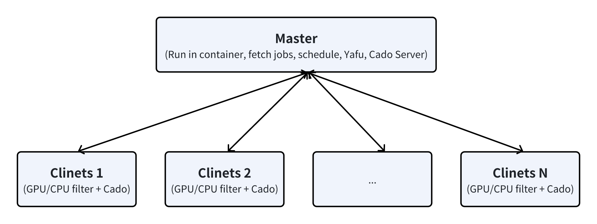

# faminer
Miner for [FACT0RN](https://www.fact0rn.io), based on yafu, cado-nfs, and msieve.

## Introduction
faminer primarily consists of a control center, a Docker container, and an RPC server.
- The control center configures, controls, and monitors the miner.
- A Docker container runs on the master node.
- The RPC server handles communication between the master and slave nodes and reports status to the control center.

The miner supports both CPU and GPU filtering.  
The linear algebra phase uses GPU (tested on 3090 and 4090).  
Dev fee: 10%


## How to Start
### Prerequisites
A FACT0RN node is required. See [FACT0RN](https://github.com/FACT0RN/FACT0RN).
### Download
* [control-center.zip](https://github.com/jostart99/faminer/releases/download/latest/control-center.zip)
```
wget https://github.com/jostart99/faminer/releases/download/latest/control-center.zip
```
* [fact-rpc-server.deb](https://github.com/jostart99/faminer/releases/download/latest/fact-rpc-server.deb)
```
wget https://github.com/jostart99/faminer/releases/download/latest/fact-rpc-server.deb
```
### Install rpc server
You need to install the RPC server on all the masters and slaves:
```
apt install -f ./fact-rpc-server.deb
```
### Configure
You should use a computer to run the control-center
#### 1. Extract control-center
```
unzip control-center.zip
```
#### 2. Enter config folder, copy xxx.txt.example to xxx.txt
```
cd ~/fact/control-center/config
cp config.txt.example config.txt
cp group.txt.example group.txt
cp hostlist.txt.example hostlist.txt
```
#### 3. Edit hostlist.txt  
For convenience, the miner uses aliases to communicate with each other. You need to configure the IP addresses and corresponding aliases. Aliases can be the same or different from the host names but must be unique.  
Example:
```
192.168.1.200 worker0
192.168.1.201 worker1
192.168.1.202 worker2
192.168.1.203 worker3
192.168.1.204 worker4
192.168.1.205 worker5
```
On the computer running the control center, copy the IP and alias to `/etc/hosts` or run the script after editing `hostlist.txt`:
```
cd ~/fact/control-center
sudo script/setup_script/set_etc_host.sh config/hostlist.txt
```
#### 4. Edit group.txt
The master and slave are separated by a comma, with the master at the beginning of the line. 
Each line is a group  
Example (worker1 and worker11 are masters):
```
worker1,worker2,worker3,worker4,worker5
worker11,worker12,worker13,worker14,worker15
```
For now, a group can only support one master
#### 5. Edit config.txt
You must fill in the following options: `rpc_url`, `rpc_pass`, `rpc_user`, and `script_key`.  
If you have set up a Docker registry, you can load and push the Docker image to your own Docker server and change the option `docker_server`.  
You can add the configuration `notify_email_address` to receive notification emails.
```
notify_email_address=aaa@bbb.com
```
### Setup miner
Use control binary to setup miners
```
./control --setup all
```
or
```
./control --setup worker1,worker2,worker3,worker4,worker5
```
This will set up the miners: download required binaries, install drivers and APKs, pull the Docker container, and more.
### Start miner
Use the control binary to start miners
```
./control --start all
```
## Monitor
Run the monitor binary to check the status of the mining machines from your terminal.  
Before running the monitor for the first time, ensure that the Python 3 rich module is installed:
```
sudo apt install python3-pip
python3 -m pip install rich
```
then
```
./monitor
```
## Logs
You can find the necessary logs in the `/root/fact/log` directory on the master.
## Stop miner
Use the control binary to stop miners
```
./control --stop all
```
## Update
Use the update binary to update the control center
```
./update
```
This will update control center and download latest rpc server and other components to binary folder.
After update, you still need use `./control --update-rpc all` or `./control --setup all` to install latest rpc server and components on workers.
### Update RPC server
Manually download or use `./update` to download latest PRC server apk to binary folder, then use below command to install RPC server
```
./control --update-rpc all
```
Installing the RPC server may cause the RPC connection to be interrupted for a few seconds up to 2 minutes. During this time, do not perform setup or other operations. You can get an overview of the status of the connection via the monitor.
